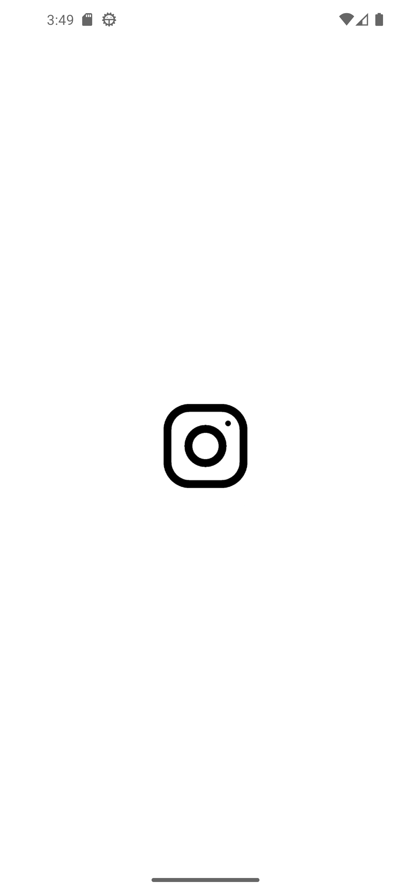

# Flutter Instagram

This program is to test flutter and dart, testing out a recreation of the Instagram UI.

# Contribution 

If you'd like to contribute to `flutter_instagram` please submit a pull-request on a feature branch.

# Installing

Clone the repo:

    git clone https://github.com/Sommos/flutter_instagram
    cd flutter_instagram

    
    
    

